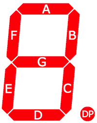
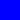
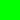
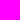
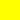
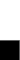

The idea behind this cipher is based on the seven segment display (think: old calculators). The graphical representation came to me in a fever dream recently and I thought it was a neat idea.

## Graphical Representation

Each letter is a rectangle comprised of 3 squares stacked vertically:
- the top square represents segments F, A, and B
- the middle square represents segments E, G, and C
- the bottom square represents segment D (and could potentially take the decimal point into account in the future)

Each of these squares will be a single color where the display segments are represented by RGB values respectively 255=lit, 0=unlit (i.e. the top segment Red=Segment F, Green=Segment A, Blue=Segment B). In the case of the bottom square, we represent segment D as Green, leaving Red and Blue as 0. This means that the bottom square will always be green or black.

For the sake of clarity, we will be using the [established Roman alphabet (upper-case)](https://en.wikipedia.org/wiki/Seven-segment_display_character_representations#Alphabet). The letters, as displayed on a seven segment display, are easier to read as upper case letters.

### Possible Colors

### Example
`A` will ight up segments ABCEFG list so the graphical representation would be:
- Top Square = (255,255,255)
- Middle Square = (255,255,255)
- Bottom Square = (0, 0, 0)

I think there might be more color variation if lower case letters are used but some experimentation will be needed.

### Villain Era

If you're in your villain era, you could add a gradient to this. The decryption code for the graphical representation takes this into account current by sampling the pixels at the center of the column and at the top of the top square, the middle of the middle square, and the bottom of the bottom square.

I haven't coded up the gradient version of the encryption method... yet.

## Binary Representation

The binary representation is easier to implement, but probably harder to figure out (if you're reverse engineering it) than the graphical representation. This is due to the digit orientation.

Each character is represented by a 7 digit binary number. The place order adheres to the segment order in the above image. Where 1 is a lit segment and 0 is an unlit segment.

### Example
A will light up segments ABCEFG, so 7 digit representation would be 1110111

